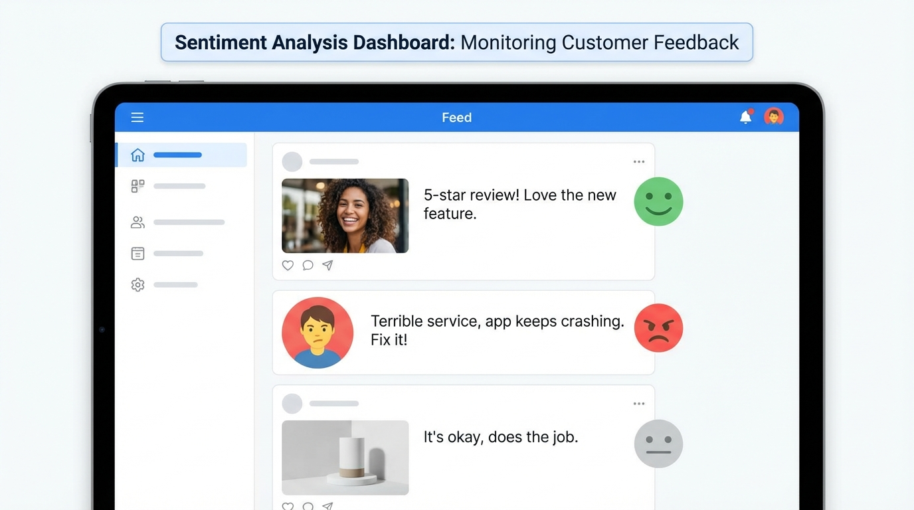
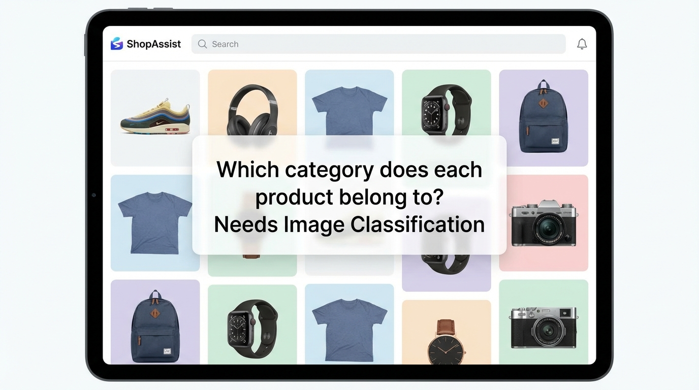

<!-- _class: title-slide -->

# Data Labeling & Annotation

## Week 3 · CS 203: Software Tools and Techniques for AI

**Prof. Nipun Batra**
*IIT Gandhinagar*

---

<!-- _class: lead -->

# Part 1: The Motivation

*From raw data to supervised learning*

---

# Previously on CS 203...

**Week 1 & 2**: We collected and cleaned movie data from the OMDB API

| Title | Year | Genre | Runtime | Director | Budget |
|-------|------|-------|---------|----------|--------|
| Inception | 2010 | Sci-Fi | 148 min | Nolan | $160M |
| The Room | 2003 | Drama | 99 min | Wiseau | $6M |
| Parasite | 2019 | Thriller | 132 min | Bong | $11M |
| ... | ... | ... | ... | ... | ... |

**Now**: We have 10,000 clean movies. Time to build a model!

**Business Question**: *"Can we predict which movies will be profitable?"*

---

# The Missing Ingredient

| Title | Year | Genre | Budget | **TotalRevenue** |
|-------|------|-------|--------|:----------------:|
| Inception | 2010 | Sci-Fi | $160M | **???** |
| The Room | 2003 | Drama | $6M | **???** |
| Parasite | 2019 | Thriller | $11M | **???** |

<div class="insight">

**The problem**: We have *features* (year, genre, budget) but no *target variable*.

Where does TotalRevenue come from? We need to **aggregate from multiple sources**:
- Domestic box office, International box office, Streaming deals, DVD/Blu-ray sales...
- Each source has different reporting standards, currencies, time windows

</div>

**Someone must collect, normalize, and aggregate revenue data → LABELS**

---

# The Labeling Bottleneck

| Title | Year | Genre | Budget | **TotalRevenue** |
|-------|------|-------|--------|:----------------:|
| Inception | 2010 | Sci-Fi | $160M | $836M ✓ |
| The Room | 2003 | Drama | $6M | $1.8M ✓ |
| Parasite | 2019 | Thriller | $11M | $263M ✓ |
| Movie #4 | 2015 | Action | $45M | **?** |
| ... | ... | ... | ... | **?** |
| Movie #10,000 | 2020 | Comedy | $12M | **?** |

**For each movie**: Query Box Office Mojo, TheNumbers, studio reports → Convert currencies → Sum domestic + international + streaming → Verify

**10,000 movies × 5 sources × currency conversion × manual verification = EXPENSIVE!**

---

# Same Data, Different Labels

**Same movie features can predict different things:**

| Task | Label Needed | Sources |
|------|--------------|---------|
| **Predict Revenue** | TotalRevenue ($) | Box Office Mojo, TheNumbers, studio reports |
| **Predict Critical Success** | CriticScore (0-100) | Rotten Tomatoes, Metacritic, IMDB |
| **Predict Audience Appeal** | AudienceScore (0-100) | RT Audience, IMDB user ratings |
| **Content Classification** | Genre tags | Manual annotation, Wikipedia |

<div class="insight">

**The label defines the task.** Same features, different labels = different ML problems.

Each label requires its own collection and aggregation effort.

</div>

---

# Today's Mission

**Learn to transform unlabeled data into labeled training data.**

1. Where does unlabeled data come from?
2. Types of labeling tasks (text, image, audio, video)
3. How to label: tools and platforms
4. How to measure label quality (IAA, Cohen's Kappa)
5. Quality control and guidelines
6. Managing annotation teams

---

<!-- _class: lead -->

# Part 2: Data Without Labels

*The abundance of data, the scarcity of labels*

---

# Unlabeled Data is Everywhere


---

# The Labeling Cost Reality

| Source | Data Volume | Labels Needed | Estimated Cost |
|--------|-------------|---------------|----------------|
| E-commerce | 1M reviews | Sentiment (pos/neg/neu) | $10K-30K |
| Call center | 10K hours | Transcripts + Intent | $50K-150K |
| Security | 1 year footage | Event annotations | $200K+ |
| Hospital | 50K scans | Tumor boundaries | $500K+ (expert) |

<div class="insight">

**ImageNet**: 14M images × $0.01/label = **$140K just for labels**

Labels are often **more expensive than the data collection itself**.

</div>

---

# The Label Gap


**The gap between available data and labeled data is enormous.**

---

# From Unlabeled to Labeled


**The labeling process is where the real work happens.**

---

# Our Tool: Label Studio

**Open-source, web-based annotation platform**

```bash
pip install label-studio
label-studio start
# → http://localhost:8080
```

**Why Label Studio?**
- Supports all modalities (text, image, audio, video)
- Free and self-hosted
- We'll see it in action for each task type

---

<!-- _class: lead -->

# Part 3: Types of Labeling Tasks

*Different problems, different annotation needs*

---

# Annotation Task Taxonomy

| **TEXT** | **IMAGES** |
|----------|------------|
| Classification | Classification |
| Named Entity Recognition | Object Detection (bbox) |
| Sentiment Analysis | Segmentation (pixel) |
| Question Answering | Keypoint Detection |
| Relation Extraction | Instance Segmentation |

| **AUDIO** | **VIDEO** |
|-----------|-----------|
| Transcription | Action Recognition |
| Speaker Identification | Object Tracking |
| Event Detection | Temporal Segmentation |
| Emotion Recognition | Dense Captioning |

---

# Text: Complexity Spectrum


---

# Vision: Complexity Spectrum


---

# Audio: Complexity Spectrum


---

# Video: Complexity Spectrum


---

# The Cost Reality

| Domain | Simple Task | Complex Task | Multiplier |
|--------|-------------|--------------|:----------:|
| **Text** | Classification: ₹2/item | Relation extraction: ₹80/item | **40x** |
| **Vision** | Image label: ₹2/img | Instance segmentation: ₹400/img | **200x** |
| **Audio** | Clip label: ₹4/clip | Full diarization: ₹150/min | **40x** |
| **Video** | Video label: ₹8/clip | Dense captioning: ₹800/min | **100x** |

<div class="insight">

**Choose the simplest task that solves your problem.**

Don't do pixel segmentation if bounding boxes suffice. Don't do NER if classification works.

</div>

---

<!-- _class: lead -->

# Part 3a: Text Annotation Tasks

*Classification, NER, sentiment, and more*

---

# The Problem: Email Overload


**Your inbox has 4,521 emails. Which are spam?**
A human can't review millions of emails. We need machines to learn the pattern.

---

# The Solution: Text Classification

**Task**: Assign label(s) to entire text.

```python
# Binary Classification (2 classes: POSITIVE, NEGATIVE)
{"text": "This movie was terrible!", "label": "NEGATIVE"}

# Multi-class Classification (pick 1 of N classes)
# Classes: BILLING, ACCOUNT_SUPPORT, TECHNICAL, SALES, OTHER
{"text": "How do I reset my password?", "label": "ACCOUNT_SUPPORT"}

# Multi-label Classification (pick any subset of classes)
# Classes: POSITIVE_FEATURE, NEGATIVE_FEATURE, NEUTRAL, QUESTION
{"text": "Great phone with poor battery",
 "labels": ["POSITIVE_FEATURE", "NEGATIVE_FEATURE"]}
```

**Annotation Interface**: Radio buttons, checkboxes, or dropdown

**Speed**: 200-500 examples/hour

---

# Text Classification: Annotation Diagram


---

# The Problem: Extracting Information from Clinical Notes


**Hospitals have millions of unstructured notes.**
How do we extract drug names, dosages, symptoms automatically?

---

# The Solution: Named Entity Recognition (NER)

**Task**: Identify and classify spans of text.

```
Text: "Apple CEO Tim Cook announced iPhone 15 in Cupertino."

Entities:
  [Apple]      @ 0:5   -> ORGANIZATION
  [Tim Cook]   @ 10:18 -> PERSON
  [iPhone 15]  @ 29:38 -> PRODUCT
  [Cupertino]  @ 42:51 -> LOCATION
```

**Annotation Format** (JSON):
```json
{
  "text": "Apple CEO Tim Cook...",
  "entities": [
    {"start": 0, "end": 5, "label": "ORG"},
    {"start": 10, "end": 18, "label": "PERSON"}
  ]
}
```

---

# NER: Annotation Diagram


---

# NER: Common Challenges

**1. Boundary Ambiguity**:
```
"New York City Mayor"
Tag "New York" or "New York City"?
```

**2. Nested Entities**:
```
"MIT AI Lab director"
- "MIT AI Lab" -> ORGANIZATION
- "MIT" -> ORGANIZATION (nested inside!)
```

**3. Overlapping Context**:
```
"Bank of America" - ORG or LOC?
"Washington" - PERSON or LOC?
```

**Solution**: Clear guidelines with examples for every edge case.

---

# The Problem: Understanding Customer Feedback at Scale



**Thousands of reviews, tweets, comments every hour.**
Is the feedback positive, negative, or neutral? What are customers saying about specific features?

---

# The Solution: Sentiment Analysis

**Task**: Classify opinion/emotion in text.

```python
# Document-level: One label per document
{"text": "Great movie! Loved every moment.", "sentiment": "POSITIVE"}

# Sentence-level: Label each sentence
{"text": "Great visuals. Poor story.", "sentences": [
    {"text": "Great visuals.", "sentiment": "POSITIVE"},
    {"text": "Poor story.", "sentiment": "NEGATIVE"}
]}
```

---

# Sentiment: Aspect-Based Analysis

```python
# Aspect-based: Sentiment per feature/aspect
{"text": "Great camera but poor battery", "aspects": [
    {"aspect": "camera", "sentiment": "POSITIVE"},
    {"aspect": "battery", "sentiment": "NEGATIVE"}
]}
```

**Granularity Spectrum:**
- **Document-level**: Simplest, fastest
- **Sentence-level**: More nuanced
- **Aspect-based**: Most detailed, slowest

---

# Sentiment: The Ambiguity Problem

**Sarcasm**:
```
"Yeah, great service... 2 hour wait!"
Literal: POSITIVE  |  Actual: NEGATIVE
```

**Mixed Sentiment**:
```
"Good product, terrible delivery"
What's the overall label?
```

**Neutral vs No Opinion**:
```
"The phone is blue"    -> NEUTRAL (factual)
"I received the phone" -> NEUTRAL (no sentiment)
```

**These require clear guidelines!**

---

# Text: Question Answering

**Task**: Find answer span in passage.


---

# Text: Relation Extraction

**Task**: Identify relationships between entities.

```
Text: "Steve Jobs founded Apple in 1976."

Entities:
  - "Steve Jobs" -> PERSON
  - "Apple" -> ORGANIZATION
  - "1976" -> DATE

Relations:
  - (Steve Jobs, FOUNDED, Apple)
  - (Apple, FOUNDED_IN, 1976)
```

**Annotation Process**:
1. First pass: Mark entities (NER)
2. Second pass: Draw relations between entities

---

# Relation Extraction: Diagram


---

<!-- _class: lead -->

# Part 3b: Image Annotation Tasks

*From classification to pixel-level segmentation*

---

# The Problem: Organizing Millions of Products



**E-commerce sites have millions of products. Which category does each belong to?**
Manual categorization is impossible at scale. We need machines to classify images.

---

# The Solution: Image Classification

**Task**: Assign label(s) to entire image.

```json
// Single-label
{"image": "photo.jpg", "label": "CAT"}

// Multi-label
{"image": "scene.jpg", "labels": ["OUTDOOR", "PEOPLE", "DAYTIME"]}

// Fine-grained
{"image": "dog.jpg", "breed": "GOLDEN_RETRIEVER", "category": "DOG"}
```

**Speed**: 100-300 images/hour

---

# Image Classification: Diagram


**Interface**: Display image, annotator selects from predefined categories

---

# The Problem: What Does a Self-Driving Car See?


**A camera captures 30 frames per second. The car must understand each one.**
Where are the pedestrians? The other cars? The traffic lights? We need bounding boxes.

---

# The Solution: Object Detection

**Task**: Locate and classify objects with bounding boxes.

```json
{
  "image": "street.jpg",
  "width": 1920, "height": 1080,
  "objects": [
    {"class": "car", "bbox": [100, 200, 400, 300]},
    {"class": "person", "bbox": [800, 150, 100, 350]}
  ]
}
```

**bbox format**: `[x, y, width, height]` or `[x1, y1, x2, y2]`

**Speed**: 20-50 images/hour (5-10 objects each)

---

# Object Detection: Diagram


**Tools**: Rectangle draw, zoom, undo | **Labels**: Car (red), Person (blue)

---

# Object Detection: Best Practices


| Guideline | Rule of Thumb |
|-----------|---------------|
| **Box tightness** | Box should touch object edges — not too loose, not cutting into object |
| **Partial occlusion** | Label if >20% of object is visible |
| **Tiny objects** | Skip if <10 pixels in either dimension |
| **Reflections** | Don't label objects in mirrors/windows |
| **Pictures on walls** | Don't label objects inside photos/posters |

---

# The Problem: Finding Tumors in Medical Scans

<div style="display: flex; justify-content: space-around; align-items: center;">
<div style="text-align: center;">


**Raw scan**

</div>
<div style="text-align: center;">


**Segmented**

</div>
</div>

**Radiologists review thousands of scans.** Every pixel matters — is it healthy tissue or tumor?

---

# The Solution: Pixel-level Annotation


**Annotators must label every single pixel** — tumor (red), healthy tissue (green), background (blue)

---

# The Solution: Semantic Segmentation

**Task**: Classify every pixel in image.

```
Input:  RGB image (1920x1080x3)
Output: Label mask (1920x1080) where each pixel in {0,1,2,...}

Pixel values:
  0 -> Background
  1 -> Person
  2 -> Car
  3 -> Road
  ...
```

**Speed**: 5-15 images/hour (very time-consuming!)

---

# Segmentation: Diagram


**Tools**: Brush, Polygon, Magic Wand, SAM (Segment Anything Model)

---

# Instance vs Semantic Segmentation


**Semantic**: All dogs = same color | **Instance**: Each dog = unique color

---

# Segmentation Formats: Binary Mask vs Polygon


| **Binary Mask** | **Polygon** |
|-----------------|-------------|
| Pixel-by-pixel (0 or 1) | List of (x, y) vertices |
| Exact boundaries | Approximate boundaries |
| Large file size | Compact storage |
| `mask[y][x] = 1` | `[(x1,y1), (x2,y2), ...]` |

**Trade-off**: Masks are precise but heavy; polygons are lightweight but approximate.

---

# Another Application: Urban Planning from Satellites


**Segmentation isn't just for medical imaging.**
Urban planners use satellite segmentation to map buildings (red), roads (gray), vegetation (green), water (blue).

---

# The Problem: Tracking Patient Movement


**Physical therapists need to track joint angles and movement patterns.**
Is the patient doing the exercise correctly? Is their range of motion improving?

---

# The Solution: Keypoint Detection

**Task**: Locate specific points (joints, landmarks).

```json
{
  "image": "person.jpg",
  "keypoints": [
    {"name": "nose", "x": 120, "y": 80, "visible": 1},
    {"name": "left_eye", "x": 110, "y": 75, "visible": 1},
    {"name": "left_shoulder", "x": 100, "y": 150, "visible": 1},
    {"name": "right_shoulder", "x": 140, "y": 150, "visible": 0}
  ]
}
```

**Visibility flags**: 0=occluded, 1=visible, 2=outside image

---

# Keypoint Detection: Diagram


**17 keypoints**: Head, shoulders, elbows, wrists, hips, knees, ankles
**Visibility flags**: 0=occluded, 1=visible, 2=outside image

---

# Audio & Video Annotation

**Same principles, more complexity:**

| Modality | Key Tasks | Challenge |
|----------|-----------|-----------|
| **Audio** | Transcription, speaker diarization, emotion | Temporal alignment, overlapping speech |
| **Video** | Object tracking, action recognition, temporal segmentation | Maintaining identity across frames (occlusion) |

**See Appendix for detailed slides on Audio/Video annotation tasks.**

---

# Annotation Speed Benchmarks

| Task Type | Speed (per hour) | Complexity |
|-----------|------------------|------------|
| Text Classification | 200-500 items | Low |
| Sentiment Analysis | 150-300 items | Low |
| NER | 50-150 sentences | Medium |
| Image Classification | 100-300 images | Low |
| Bounding Boxes | 20-50 images | Medium |
| Segmentation | 5-15 images | High |
| Audio Transcription | 15-30 min audio | Medium |
| Video Tracking | 5-10 min video | High |

**Use these to estimate labeling time and cost!**

---

<!-- _class: lead -->

# Part 4: Labeling Tools & Platforms

*Software for annotation*

---

# Labeling Tool Landscape

| **Open Source** | **Commercial** |
|-----------------|----------------|
| Label Studio (flexible) | Labelbox (enterprise) |
| CVAT (video/CV focused) | Scale AI (full service) |
| Doccano (NLP focused) | V7 (auto-annotation) |
| VGG Image Annotator | Prodigy (active learning) |
| | Amazon SageMaker GT |

**Start open source, scale to commercial when needed.**

---

# Label Studio: The Swiss Army Knife

**Open-source, web-based, highly flexible**

```bash
# Installation
pip install label-studio

# Start server
label-studio start

# Access at http://localhost:8080
```

**Key Features**:
- Supports all modalities (text, image, audio, video)
- Customizable interfaces via XML config
- Export to many formats (JSON, CSV, COCO, YOLO)
- ML-assisted labeling
- Multi-user support

---

# Label Studio: Text Classification Config

```xml
<View>
  <Text name="text" value="$text"/>
  <Choices name="sentiment" toName="text" choice="single">
    <Choice value="Positive"/>
    <Choice value="Negative"/>
    <Choice value="Neutral"/>
  </Choices>
</View>
```

**Result**: Text displayed with radio buttons for selection.

---

# Label Studio: NER Config

```xml
<View>
  <Labels name="ner" toName="text">
    <Label value="PERSON" background="#FF0000"/>
    <Label value="ORG" background="#00FF00"/>
    <Label value="LOCATION" background="#0000FF"/>
    <Label value="DATE" background="#FFFF00"/>
  </Labels>
  <Text name="text" value="$text"/>
</View>
```

**Result**: Highlight text to assign entity labels.

---

# Label Studio: Object Detection Config

```xml
<View>
  <Image name="img" value="$image"/>
  <RectangleLabels name="bbox" toName="img">
    <Label value="Car" background="red"/>
    <Label value="Person" background="blue"/>
    <Label value="Bicycle" background="green"/>
  </RectangleLabels>
</View>
```

**Supports**: Rectangles, polygons, brush, keypoints

---

# CVAT: Video & CV Focus

**Computer Vision Annotation Tool** (Intel)

**Strengths**:
- Excellent for video annotation
- Automatic tracking (interpolation)
- Semi-automatic annotation with models
- 3D cuboid support

```bash
# Docker installation
docker-compose up -d
```

**Best for**: Video object tracking, autonomous driving datasets

---

# Crowdsourcing Platforms

| Platform | Cost | Quality | Best For |
|----------|------|---------|----------|
| Amazon MTurk | $0.01-0.10/task | Variable | Simple tasks |
| Scale AI | $1-5/task | High | Complex CV |
| Labelbox | Subscription | Med-High | Enterprise |
| Prolific | $0.10-0.50/task | Higher | Research |
| Appen | Variable | Medium | Multilingual |

**Key Insight**: You get what you pay for.

---

# Tool Selection Guide

| Use Case | Recommended Tool |
|----------|------------------|
| Prototyping / Learning | Label Studio |
| Video / Tracking | CVAT |
| NLP / Text Focus | Prodigy or Doccano |
| Enterprise Scale | Labelbox |
| Full-Service | Scale AI |
| Research Crowdsourcing | Prolific |
| Budget Crowdsourcing | Amazon MTurk |

**Start with Label Studio (free), scale up as needed.**

---

<!-- _class: lead -->

# Part 5: Label Quality & IAA

*How do we know labels are correct?*

---

# The Quality Problem

**Labels are created by humans. Humans disagree.**


```
Text: "This movie was okay"

Annotator 1 → POSITIVE  (they're being polite!)
Annotator 2 → NEUTRAL   (okay = average)
Annotator 3 → NEGATIVE  (okay = disappointed)
```

**Who is right?** It depends on your guidelines!

---

# Real-World Disagreement Examples

| Domain | Example | Why People Disagree |
|--------|---------|---------------------|
| Medical | Is this X-ray showing pneumonia? | Subtle patterns, experience level |
| Sentiment | "Not bad for what it is" | Sarcasm, context, cultural |
| Spam | Newsletter from a store you signed up for | Intent vs. content |
| Toxicity | Political criticism | Subjectivity, personal values |

**Disagreement is normal.** The question is: *how much* disagreement is acceptable?

---

# Why Agreement Matters

**If humans can't agree, how can we expect a model to learn?**


Low agreement → Noisy labels → Confused model → Poor predictions

---

# The Coin Flip Problem

**Imagine two annotators labeling randomly (but with their own biases):**

| Email | Ann A | Ann B | Agree? |
|-------|-------|-------|--------|
| 1 | Spam | Spam | ✓ |
| 2 | Not Spam | Spam | ✗ |
| 3 | Spam | Spam | ✓ |
| 4 | Not Spam | Not Spam | ✓ |
| 5 | Spam | Not Spam | ✗ |

**Observed agreement**: 3/5 = **60%** — sounds decent?

**But what if they labeled randomly with their proportions?**
- Ann A: 3/5 Spam | Ann B: 3/5 Spam
- P(both Spam) = 0.6 × 0.6 = 0.36
- P(both Not) = 0.4 × 0.4 = 0.16
- **P(agree by chance) = 0.52**

60% observed vs 52% expected — barely better than random!

---

# Why 80% Agreement Can Be Misleading

**Two annotators label 10 emails:**

```
Email:   1    2    3    4    5    6    7    8    9   10
Ann A:   S    N    S    S    N    S    N    N    S    S
Ann B:   S    N    S    N    N    S    N    S    S    S
```

**Percent Agreement**: 8/10 = **80%**

**But wait**: Random guessing gives 50% agreement.

So 80% is only **30 percentage points above chance**.

Is that impressive? We need a metric that tells us: *"How much better than random are we?"*

---

# Cohen's Kappa: The Formula

**Kappa answers**: "How much better than chance is your agreement?"

$$\kappa = \frac{P_{observed} - P_{expected}}{1 - P_{expected}}$$

| Kappa | Meaning |
|-------|---------|
| 0 | No better than random guessing |
| 1 | Perfect agreement |
| <0 | Worse than random (labels swapped?) |

---

# Kappa Example: Spam Classification

```
Email:   1  2  3  4  5  6  7  8  9  10
Ann A:   S  N  S  S  N  S  N  N  S  S   (6 Spam, 4 Not)
Ann B:   S  N  S  N  N  S  N  S  S  S   (6 Spam, 4 Not)
         ✓  ✓  ✓  ✗  ✓  ✓  ✓  ✗  ✓  ✓   → 8/10 = 80% agree
```

| Step | Calculation | Result |
|------|-------------|--------|
| P_observed | 8/10 | **0.80** |
| P_expected | (0.6×0.6) + (0.4×0.4) | **0.52** |
| **κ** | (0.80 - 0.52) / (1 - 0.52) | **0.58** |

80% sounds good, but κ=0.58 reveals it's only **moderately** better than chance!

```python
from sklearn.metrics import cohen_kappa_score
kappa = cohen_kappa_score(ann_a, ann_b)  # 0.58
```

---

# Kappa Interpretation Guide

| Kappa | Level | Action |
|-------|-------|--------|
| < 0 | Worse than chance | Check for label swap! |
| 0.0–0.40 | Slight/Fair | Major guideline rewrite |
| 0.41–0.60 | Moderate | Refine guidelines |
| 0.61–0.80 | Substantial | Minor tweaks |
| **0.81–1.0** | **Almost Perfect** | **Production ready!** |

**Target**: κ ≥ 0.8 for production | **If κ < 0.6**: Fix guidelines before collecting more data!

---

# Beyond Cohen's Kappa

| Scenario | Use This Metric |
|----------|-----------------|
| 2 annotators, categorical | **Cohen's Kappa** |
| 3+ annotators, categorical | **Fleiss' Kappa** |
| Bounding boxes / masks | **IoU** (Intersection over Union) |
| Text spans (NER) | **Span F1** |
| Transcription | **WER** (Word Error Rate) |

**Same intuition**: How much better than chance?

---

# IoU for Spatial Annotations


**IoU > 0.5**: Generally considered a match | **IoU > 0.7**: Good agreement

---

# IoU for Segmentation Masks


```python
def segmentation_iou(mask1, mask2):
    intersection = np.logical_and(mask1, mask2).sum()
    union = np.logical_or(mask1, mask2).sum()
    return intersection / union if union > 0 else 0
```

**Also common**: Dice = 2×Intersection / (|A| + |B|)

---

# Typical IAA by Task Type

| Task | Metric | Typical Good IAA |
|------|--------|------------------|
| Text Classification | Cohen's Kappa | > 0.8 |
| Sentiment Analysis | Cohen's Kappa | > 0.7 |
| NER | Span F1 | > 0.85 |
| Object Detection | Mean IoU | > 0.7 |
| Segmentation | Mean IoU | > 0.8 |
| Transcription | WER < 5% | Between annotators |
| Emotion Recognition | Cohen's Kappa | > 0.6 (subjective) |

---

<!-- _class: lead -->

# Part 6: Quality Control

*Brief overview — details in lab*

---

# Quality Control: 6 Pillars

| Pillar | Key Point |
|--------|-----------|
| **1. GUIDELINES** | Clear definitions + edge cases |
| **2. TRAINING** | Calibration rounds until κ > 0.8 |
| **3. GOLD STANDARD** | 10% known-correct items mixed in |
| **4. REDUNDANCY** | 2-3 annotators per item |
| **5. MONITORING** | Track IAA and accuracy over time |
| **6. ADJUDICATION** | Majority vote or expert review |

**Workflow**: Pilot (50-100 items) → Measure IAA → Fix guidelines → Production

---

<!-- _class: lead -->

# Part 7: Key Takeaways

---

# Interview Questions

**Common interview questions on data labeling:**

1. **"How would you ensure label quality in a large annotation project?"**
   - Use multiple annotators (redundancy)
   - Calculate inter-annotator agreement (Cohen's Kappa)
   - Include gold standard questions for monitoring
   - Write clear guidelines with edge cases
   - Run calibration sessions before production

2. **"What is Cohen's Kappa and why use it instead of percent agreement?"**
   - Kappa accounts for chance agreement
   - Two random guessers on binary task agree 50% by chance
   - Kappa measures how much better than chance your agreement is
   - Target: Kappa >= 0.8 for production-ready labels

---

# Key Takeaways

1. **Labels are the bottleneck** - 80% of AI project time

2. **Different tasks, different challenges** - NER != Classification != Segmentation

3. **Start with Label Studio** - Free, flexible, supports all modalities

4. **Measure agreement** - Cohen's Kappa >= 0.8 before production

5. **Invest in guidelines** - Decision trees, examples, edge cases

6. **Quality control is ongoing** - Gold questions, redundancy, monitoring

7. **Budget realistically** - complexity * redundancy * domain expertise

---

<!-- _class: lead -->

# Part 8: Lab Preview

*What you'll build today*

---

# This Week's Lab

**Hands-on Practice:**

1. **Install Label Studio** - Set up local annotation server

2. **Create annotation project** - Configure for sentiment analysis

3. **Write guidelines** - Clear definitions and examples

4. **Label data** - Annotate 30 movie reviews

5. **Calculate IAA** - Measure Cohen's Kappa with a partner

6. **Discuss disagreements** - Refine guidelines based on edge cases

---

# Lab Setup Preview

```bash
# Install Label Studio
pip install label-studio

# Start the server
label-studio start

# Access at http://localhost:8080
```

**You'll create a sentiment analysis project and experience the full annotation workflow!**

---

# Next Week Preview

**Week 4: Optimizing Labeling**

- Active Learning - smart sampling to reduce labeling effort
- Weak Supervision - programmatic labeling with rules
- LLM-based labeling - using GPT/Claude as annotators
- Noisy label detection and handling

**The techniques to make labeling 10x more efficient!**

---

# Resources

**Tools:**
- Label Studio: https://labelstud.io/
- CVAT: https://cvat.ai/
- Prodigy: https://prodi.gy/

**Metrics:**
- sklearn.metrics.cohen_kappa_score
- statsmodels fleiss_kappa

**Reading:**
- Annotation guidelines (Google, Amazon, Microsoft examples online)

---

<!-- _class: lead -->

# Questions?

---

<!-- _class: lead -->

# Thank You!

See you in the lab!

---

<!-- _class: lead -->

# Appendix: Audio & Video Annotation

*Reference slides — not covered in lecture*

---

# Audio: Transcription

**Task**: Convert speech to text with timestamps.

```json
{
  "audio": "interview.wav",
  "transcription": [
    {"start": 0.0, "end": 3.2, "speaker": "A", "text": "Hello, how are you?"},
    {"start": 3.5, "end": 5.8, "speaker": "B", "text": "I'm doing well, thank you."}
  ]
}
```

**Challenges**: Speaker diarization, overlapping speech, accents, filler words

---

# Audio: Sound Event Detection

**Task**: Identify and timestamp sound events.

```json
{
  "audio": "home_audio.wav",
  "events": [
    {"start": 2.3, "end": 3.1, "label": "door_slam"},
    {"start": 5.0, "end": 8.2, "label": "dog_bark"},
    {"start": 10.5, "end": 11.0, "label": "glass_break"}
  ]
}
```

**Applications**: Surveillance, healthcare monitoring, environmental sounds

---

# Video: Object Tracking

**Task**: Follow the *same* object across multiple frames.

```json
{
  "video": "traffic.mp4",
  "tracks": [
    {
      "track_id": 1,        // Same ID across all frames!
      "category": "car",
      "bboxes": [
        {"frame": 0, "bbox": [100, 200, 50, 80]},
        {"frame": 1, "bbox": [105, 202, 50, 80]},
        {"frame": 2, "bbox": [110, 204, 50, 80]}
      ]
    }
  ]
}
```

**Challenge**: Re-identification after occlusion

---

# Video: Temporal Segmentation

**Task**: Divide video into meaningful segments.


| Segment | Start | End | Label |
|---------|-------|-----|-------|
| 1 | 0:00 | 0:15 | gather_ingredients |
| 2 | 0:15 | 0:45 | chop_vegetables |
| 3 | 0:45 | 1:30 | cook_in_pan |

**Applications**: Sports analysis, surgical videos, tutorials

---

# Span F1 for NER


| Metric | Value |
|--------|-------|
| **Exact Match** | 2/3 = 0.67 (spans must match exactly) |
| **Partial Match** | 3/3 = 1.0 (overlapping spans count) |

**Span F1** = Harmonic mean of Precision & Recall on entity spans

---

# WER for Transcription


$$\text{WER} = \frac{\text{Substitutions} + \text{Insertions} + \text{Deletions}}{\text{Total Words}}$$

```python
import jiwer
wer = jiwer.wer("The cat sat on the mat", "The cat sit on a mat")
print(f"WER: {wer:.1%}")  # 33.3%
```

---

# IoU: Python Implementation

```python
def calculate_iou(box1, box2):
    """Calculate IoU between two boxes [x1, y1, x2, y2]."""
    x1, y1 = max(box1[0], box2[0]), max(box1[1], box2[1])
    x2, y2 = min(box1[2], box2[2]), min(box1[3], box2[3])

    if x2 < x1 or y2 < y1:
        return 0.0  # No overlap

    intersection = (x2 - x1) * (y2 - y1)
    area1 = (box1[2] - box1[0]) * (box1[3] - box1[1])
    area2 = (box2[2] - box2[0]) * (box2[3] - box2[1])
    return intersection / (area1 + area2 - intersection)
```
