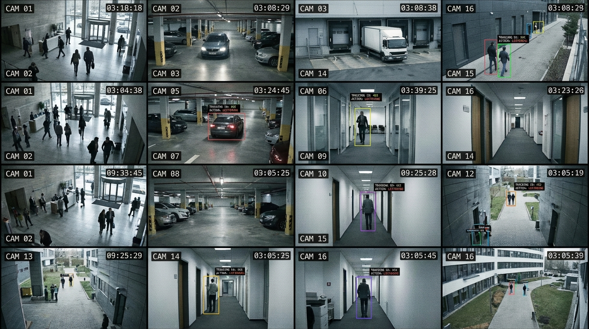

<!-- _class: title-slide -->

# Data Labeling & Annotation

## Week 3 · CS 203: Software Tools and Techniques for AI

**Prof. Nipun Batra**
*IIT Gandhinagar*

---

<!-- _class: lead -->

# Part 1: The Motivation

*From raw data to supervised learning*

---

# Previously on CS 203...

**Week 1 & 2**: We collected and cleaned movie data from the OMDB API

| Title | Year | Genre | Runtime | Director | Budget |
|-------|------|-------|---------|----------|--------|
| Inception | 2010 | Sci-Fi | 148 min | Nolan | $160M |
| The Room | 2003 | Drama | 99 min | Wiseau | $6M |
| Parasite | 2019 | Thriller | 132 min | Bong | $11M |
| ... | ... | ... | ... | ... | ... |

**Now**: We have 10,000 clean movies. Time to build a model!

**Business Question**: *"Can we predict which movies will be profitable?"*

---

# The Missing Ingredient

| Title | Year | Genre | Budget | **TotalRevenue** |
|-------|------|-------|--------|:----------------:|
| Inception | 2010 | Sci-Fi | $160M | **???** |
| The Room | 2003 | Drama | $6M | **???** |
| Parasite | 2019 | Thriller | $11M | **???** |

<div class="insight">

**The problem**: We have *features* (year, genre, budget) but no *target variable*.

Where does TotalRevenue come from? We need to **aggregate from multiple sources**:
- Domestic box office, International box office, Streaming deals, DVD/Blu-ray sales...
- Each source has different reporting standards, currencies, time windows

</div>

**Someone must collect, normalize, and aggregate revenue data → LABELS**

---

# The Labeling Bottleneck

| Title | Year | Genre | Budget | **TotalRevenue** |
|-------|------|-------|--------|:----------------:|
| Inception | 2010 | Sci-Fi | $160M | $836M ✓ |
| The Room | 2003 | Drama | $6M | $1.8M ✓ |
| Parasite | 2019 | Thriller | $11M | $263M ✓ |
| Movie #4 | 2015 | Action | $45M | **?** |
| ... | ... | ... | ... | **?** |
| Movie #10,000 | 2020 | Comedy | $12M | **?** |

**For each movie**: Query Box Office Mojo, TheNumbers, studio reports → Convert currencies → Sum domestic + international + streaming → Verify

**10,000 movies × 5 sources × currency conversion × manual verification = EXPENSIVE!**

---

# Same Data, Different Labels

**Same movie features can predict different things:**

| Task | Label Needed | Sources |
|------|--------------|---------|
| **Predict Revenue** | TotalRevenue ($) | Box Office Mojo, TheNumbers, studio reports |
| **Predict Critical Success** | CriticScore (0-100) | Rotten Tomatoes, Metacritic, IMDB |
| **Predict Audience Appeal** | AudienceScore (0-100) | RT Audience, IMDB user ratings |
| **Content Classification** | Genre tags | Manual annotation, Wikipedia |

<div class="insight">

**The label defines the task.** Same features, different labels = different ML problems.

Each label requires its own collection and aggregation effort.

</div>

---

# Today's Mission

**Learn to transform unlabeled data into labeled training data.**

1. Where does unlabeled data come from?
2. Types of labeling tasks (text, image, audio, video)
3. How to label: tools and platforms
4. How to measure label quality (IAA, Cohen's Kappa)
5. Quality control and guidelines
6. Managing annotation teams

---

<!-- _class: lead -->

# Part 2: Data Without Labels

*The abundance of data, the scarcity of labels*

---

# Unlabeled Data is Everywhere


---

# The Labeling Cost Reality

| Source | Data Volume | Labels Needed | Estimated Cost |
|--------|-------------|---------------|----------------|
| E-commerce | 1M reviews | Sentiment (pos/neg/neu) | $10K-30K |
| Call center | 10K hours | Transcripts + Intent | $50K-150K |
| Security | 1 year footage | Event annotations | $200K+ |
| Hospital | 50K scans | Tumor boundaries | $500K+ (expert) |

<div class="insight">

**ImageNet**: 14M images × $0.01/label = **$140K just for labels**

Labels are often **more expensive than the data collection itself**.

</div>

---

# The Label Gap


**The gap between available data and labeled data is enormous.**

---

# From Unlabeled to Labeled


**The labeling process is where the real work happens.**

---

<!-- _class: lead -->

# Part 3: Types of Labeling Tasks

*Different problems, different annotation needs*

---

# Annotation Task Taxonomy

| **TEXT** | **IMAGES** |
|----------|------------|
| Classification | Classification |
| Named Entity Recognition | Object Detection (bbox) |
| Sentiment Analysis | Segmentation (pixel) |
| Question Answering | Keypoint Detection |
| Relation Extraction | Instance Segmentation |

| **AUDIO** | **VIDEO** |
|-----------|-----------|
| Transcription | Action Recognition |
| Speaker Identification | Object Tracking |
| Event Detection | Temporal Segmentation |
| Emotion Recognition | Dense Captioning |

---

# Text: Complexity Spectrum


---

# Vision: Complexity Spectrum


---

# Audio: Complexity Spectrum


---

# Video: Complexity Spectrum


---

# The Cost Reality

| Domain | Simple Task | Complex Task | Multiplier |
|--------|-------------|--------------|:----------:|
| **Text** | Classification: ₹2/item | Relation extraction: ₹80/item | **40x** |
| **Vision** | Image label: ₹2/img | Instance segmentation: ₹400/img | **200x** |
| **Audio** | Clip label: ₹4/clip | Full diarization: ₹150/min | **40x** |
| **Video** | Video label: ₹8/clip | Dense captioning: ₹800/min | **100x** |

<div class="insight">

**Choose the simplest task that solves your problem.**

Don't do pixel segmentation if bounding boxes suffice. Don't do NER if classification works.

</div>

---

<!-- _class: lead -->

# Part 3a: Text Annotation Tasks

---

# The Problem: Email Overload


**Your inbox has 4,521 emails. Which are spam?**
A human can't review millions of emails. We need machines to learn the pattern.

---

# The Solution: Text Classification

**Task**: Assign label(s) to entire text.

```python
# Binary Classification (2 classes: POSITIVE, NEGATIVE)
{"text": "This movie was terrible!", "label": "NEGATIVE"}

# Multi-class Classification (pick 1 of N classes)
# Classes: BILLING, ACCOUNT_SUPPORT, TECHNICAL, SALES, OTHER
{"text": "How do I reset my password?", "label": "ACCOUNT_SUPPORT"}

# Multi-label Classification (pick any subset of classes)
# Classes: POSITIVE_FEATURE, NEGATIVE_FEATURE, NEUTRAL, QUESTION
{"text": "Great phone with poor battery",
 "labels": ["POSITIVE_FEATURE", "NEGATIVE_FEATURE"]}
```

**Annotation Interface**: Radio buttons, checkboxes, or dropdown

**Speed**: 200-500 examples/hour

---

# Text Classification: Annotation Diagram


---

# The Problem: Extracting Information from Clinical Notes


**Hospitals have millions of unstructured notes.**
How do we extract drug names, dosages, symptoms automatically?

---

# The Solution: Named Entity Recognition (NER)

**Task**: Identify and classify spans of text.

```
Text: "Apple CEO Tim Cook announced iPhone 15 in Cupertino."

Entities:
  [Apple]      @ 0:5   -> ORGANIZATION
  [Tim Cook]   @ 10:18 -> PERSON
  [iPhone 15]  @ 29:38 -> PRODUCT
  [Cupertino]  @ 42:51 -> LOCATION
```

**Annotation Format** (JSON):
```json
{
  "text": "Apple CEO Tim Cook...",
  "entities": [
    {"start": 0, "end": 5, "label": "ORG"},
    {"start": 10, "end": 18, "label": "PERSON"}
  ]
}
```

---

# NER: Annotation Diagram


---

# NER: Common Challenges

**1. Boundary Ambiguity**:
```
"New York City Mayor"
Tag "New York" or "New York City"?
```

**2. Nested Entities**:
```
"MIT AI Lab director"
- "MIT AI Lab" -> ORGANIZATION
- "MIT" -> ORGANIZATION (nested inside!)
```

**3. Overlapping Context**:
```
"Bank of America" - ORG or LOC?
"Washington" - PERSON or LOC?
```

**Solution**: Clear guidelines with examples for every edge case.

---

# The Problem: Understanding Customer Feedback at Scale


**Thousands of reviews, tweets, comments every hour.**
Is the feedback positive, negative, or neutral? What are customers saying about specific features?

---

# The Solution: Sentiment Analysis

**Task**: Classify opinion/emotion in text.

```python
# Document-level: One label per document
{"text": "Great movie! Loved every moment.", "sentiment": "POSITIVE"}

# Sentence-level: Label each sentence
{"text": "Great visuals. Poor story.", "sentences": [
    {"text": "Great visuals.", "sentiment": "POSITIVE"},
    {"text": "Poor story.", "sentiment": "NEGATIVE"}
]}
```

---

# Sentiment: Aspect-Based Analysis

```python
# Aspect-based: Sentiment per feature/aspect
{"text": "Great camera but poor battery", "aspects": [
    {"aspect": "camera", "sentiment": "POSITIVE"},
    {"aspect": "battery", "sentiment": "NEGATIVE"}
]}
```

**Granularity Spectrum:**
- **Document-level**: Simplest, fastest
- **Sentence-level**: More nuanced
- **Aspect-based**: Most detailed, slowest

---

# Sentiment: The Ambiguity Problem

**Sarcasm**:
```
"Yeah, great service... 2 hour wait!"
Literal: POSITIVE  |  Actual: NEGATIVE
```

**Mixed Sentiment**:
```
"Good product, terrible delivery"
What's the overall label?
```

**Neutral vs No Opinion**:
```
"The phone is blue"    -> NEUTRAL (factual)
"I received the phone" -> NEUTRAL (no sentiment)
```

**These require clear guidelines!**

---

# Text: Question Answering

**Task**: Find answer span in passage.


---

# Text: Relation Extraction

**Task**: Identify relationships between entities.

```
Text: "Steve Jobs founded Apple in 1976."

Entities:
  - "Steve Jobs" -> PERSON
  - "Apple" -> ORGANIZATION
  - "1976" -> DATE

Relations:
  - (Steve Jobs, FOUNDED, Apple)
  - (Apple, FOUNDED_IN, 1976)
```

**Annotation Process**:
1. First pass: Mark entities (NER)
2. Second pass: Draw relations between entities

---

# Relation Extraction: Diagram


---

<!-- _class: lead -->

# Part 3b: Image Annotation Tasks

---

# The Problem: Organizing Millions of Products


**E-commerce sites have millions of products. Which category does each belong to?**
Manual categorization is impossible at scale. We need machines to classify images.

---

# The Solution: Image Classification

**Task**: Assign label(s) to entire image.

```json
// Single-label
{"image": "photo.jpg", "label": "CAT"}

// Multi-label
{"image": "scene.jpg", "labels": ["OUTDOOR", "PEOPLE", "DAYTIME"]}

// Fine-grained
{"image": "dog.jpg", "breed": "GOLDEN_RETRIEVER", "category": "DOG"}
```

**Speed**: 100-300 images/hour

---

# Image Classification: Diagram


**Interface**: Display image, annotator selects from predefined categories

---

# The Problem: What Does a Self-Driving Car See?


**A camera captures 30 frames per second. The car must understand each one.**
Where are the pedestrians? The other cars? The traffic lights? We need bounding boxes.

---

# The Solution: Object Detection

**Task**: Locate and classify objects with bounding boxes.

```json
{
  "image": "street.jpg",
  "width": 1920, "height": 1080,
  "objects": [
    {"class": "car", "bbox": [100, 200, 400, 300]},
    {"class": "person", "bbox": [800, 150, 100, 350]}
  ]
}
```

**bbox format**: `[x, y, width, height]` or `[x1, y1, x2, y2]`

**Speed**: 20-50 images/hour (5-10 objects each)

---

# Object Detection: Diagram


**Tools**: Rectangle draw, zoom, undo | **Labels**: Car (red), Person (blue)

---

# Object Detection: Best Practices


| Guideline | Rule of Thumb |
|-----------|---------------|
| **Box tightness** | Box should touch object edges — not too loose, not cutting into object |
| **Partial occlusion** | Label if >20% of object is visible |
| **Tiny objects** | Skip if <10 pixels in either dimension |
| **Reflections** | Don't label objects in mirrors/windows |
| **Pictures on walls** | Don't label objects inside photos/posters |

---

# The Problem: Finding Tumors in Medical Scans


**Radiologists review thousands of scans.** Every pixel matters — is it healthy tissue or tumor?

---

# The Solution: Pixel-level Annotation


**Annotators must label every single pixel** — tumor (red), healthy tissue (green), background (blue)

---

# The Solution: Semantic Segmentation

**Task**: Classify every pixel in image.

```
Input:  RGB image (1920x1080x3)
Output: Label mask (1920x1080) where each pixel in {0,1,2,...}

Pixel values:
  0 -> Background
  1 -> Person
  2 -> Car
  3 -> Road
  ...
```

**Speed**: 5-15 images/hour (very time-consuming!)

---

# Segmentation: Diagram


**Tools**: Brush, Polygon, Magic Wand, SAM (Segment Anything Model)

---

# Instance vs Semantic Segmentation


**Semantic**: All dogs = same color | **Instance**: Each dog = unique color

---

# Another Application: Urban Planning from Satellites


**Segmentation isn't just for medical imaging.**
Urban planners use satellite segmentation to map buildings, roads, vegetation, water bodies.

---

# The Problem: Tracking Patient Movement


**Physical therapists need to track joint angles and movement patterns.**
Is the patient doing the exercise correctly? Is their range of motion improving?

---

# The Solution: Keypoint Detection

**Task**: Locate specific points (joints, landmarks).

```json
{
  "image": "person.jpg",
  "keypoints": [
    {"name": "nose", "x": 120, "y": 80, "visible": 1},
    {"name": "left_eye", "x": 110, "y": 75, "visible": 1},
    {"name": "left_shoulder", "x": 100, "y": 150, "visible": 1},
    {"name": "right_shoulder", "x": 140, "y": 150, "visible": 0}
  ]
}
```

**Visibility flags**: 0=occluded, 1=visible, 2=outside image

---

# Keypoint Detection: Diagram


**17 keypoints**: Head, shoulders, elbows, wrists, hips, knees, ankles
**Visibility flags**: 0=occluded, 1=visible, 2=outside image

---

<!-- _class: lead -->

# Part 3c: Audio Annotation Tasks

---

# The Problem: 10,000 Hours of Customer Calls


**Call centers record every conversation. How do we extract insights?**
What are customers complaining about? Which agents perform best? We need transcription.

---

# The Solution: Audio Transcription

**Task**: Convert speech to text with timestamps.

```json
{
  "audio": "interview.wav",
  "transcription": [
    {"start": 0.0, "end": 3.2, "speaker": "A",
     "text": "Hello, how are you?"},
    {"start": 3.5, "end": 5.8, "speaker": "B",
     "text": "I'm doing well, thank you."}
  ]
}
```

**Speed**: 15-30 min of audio per hour of work (3-4x real-time)

---

# Audio Transcription: Diagram


---

# Transcription Challenges

**1. Speaker Diarization** - Who is speaking?
```
[0:00-0:02] Speaker A: "I think that--"
[0:01-0:03] Speaker B: "No wait, listen..."  <- Overlap!
```

**2. Background Sounds**
```
"The cat [dog barking] jumped over the fence"
```

**3. Accents & Dialects**
```
"gonna" vs "going to" - Transcribe verbatim?
```

**4. Filler Words**
```
"So, um, I was thinking, like, maybe we could, uh..."
Include or remove?
```

---

# Audio: Sound Event Detection

**Task**: Identify and timestamp sound events.

```json
{
  "audio": "home_audio.wav",
  "events": [
    {"start": 2.3, "end": 3.1, "label": "door_slam"},
    {"start": 5.0, "end": 8.2, "label": "dog_bark"},
    {"start": 10.5, "end": 11.0, "label": "glass_break"}
  ]
}
```

**Applications**:
- Surveillance: gunshot, glass break
- Healthcare: cough, snore
- Environment: bird species, vehicles

---

# Audio: Speaker & Emotion Recognition

**Speaker Recognition**:
```json
{
  "audio": "meeting.wav",
  "segments": [
    {"start": 0, "end": 5, "speaker": "Alice"},
    {"start": 5, "end": 12, "speaker": "Bob"}
  ]
}
```

**Emotion Recognition**:
```json
{
  "audio": "utterance.wav",
  "emotion": "angry",
  "arousal": 7,    // 1-9 scale (calm to excited)
  "valence": 2     // 1-9 scale (negative to positive)
}
```

**Challenge**: Emotion is subjective - expect lower IAA

---

<!-- _class: lead -->

# Part 3d: Video Annotation Tasks

---

# The Problem: Monitoring Security Across Hundreds of Cameras



**Security teams can't watch all cameras simultaneously.**
Who entered the building? Which car is that? Where did the person go? We need video understanding.

---

# The Solution: Video Action Recognition

**Task**: Classify actions in video clips.

```json
{
  "video": "sports.mp4",
  "fps": 30,
  "actions": [
    {"start_frame": 0, "end_frame": 90, "label": "running"},
    {"start_frame": 90, "end_frame": 150, "label": "jumping"},
    {"start_frame": 150, "end_frame": 200, "label": "landing"}
  ]
}
```

**Types**:
- **Clip-level**: One label per clip
- **Temporal**: Start/end for each action
- **Dense**: Label every frame

---

# Video: Object Tracking

**Task**: Follow objects across frames.

```json
{
  "video": "traffic.mp4",
  "tracks": [
    {
      "track_id": 1,
      "category": "car",
      "bboxes": [
        {"frame": 0, "bbox": [100, 200, 50, 80]},
        {"frame": 1, "bbox": [105, 202, 50, 80]},
        {"frame": 2, "bbox": [110, 204, 50, 80]}
      ]
    }
  ]
}
```

**Challenges**: Occlusion, re-identification after disappearing

---

# Video Tracking: Diagram


**Key concept**: Same object maintains consistent ID across frames
**Challenges**: Occlusion, re-identification after object disappears

---

# Video: Temporal Segmentation

**Task**: Divide video into meaningful segments.

```json
{
  "video": "cooking_recipe.mp4",
  "segments": [
    {"start": 0, "end": 15, "label": "gather_ingredients"},
    {"start": 15, "end": 45, "label": "chop_vegetables"},
    {"start": 45, "end": 90, "label": "cook_in_pan"},
    {"start": 90, "end": 120, "label": "plate_and_serve"}
  ]
}
```

**Applications**: Sports analysis, surgical videos, tutorials

---

# Annotation Speed Benchmarks

| Task Type | Speed (per hour) | Complexity |
|-----------|------------------|------------|
| Text Classification | 200-500 items | Low |
| Sentiment Analysis | 150-300 items | Low |
| NER | 50-150 sentences | Medium |
| Image Classification | 100-300 images | Low |
| Bounding Boxes | 20-50 images | Medium |
| Segmentation | 5-15 images | High |
| Audio Transcription | 15-30 min audio | Medium |
| Video Tracking | 5-10 min video | High |

**Use these to estimate labeling time and cost!**

---

<!-- _class: lead -->

# Part 4: Labeling Tools & Platforms

*Software for annotation*

---

# Labeling Tool Landscape

| **Open Source** | **Commercial** |
|-----------------|----------------|
| Label Studio (flexible) | Labelbox (enterprise) |
| CVAT (video/CV focused) | Scale AI (full service) |
| Doccano (NLP focused) | V7 (auto-annotation) |
| VGG Image Annotator | Prodigy (active learning) |
| | Amazon SageMaker GT |

**Start open source, scale to commercial when needed.**

---

# Label Studio: The Swiss Army Knife

**Open-source, web-based, highly flexible**

```bash
# Installation
pip install label-studio

# Start server
label-studio start

# Access at http://localhost:8080
```

**Key Features**:
- Supports all modalities (text, image, audio, video)
- Customizable interfaces via XML config
- Export to many formats (JSON, CSV, COCO, YOLO)
- ML-assisted labeling
- Multi-user support

---

# Label Studio: Text Classification Config

```xml
<View>
  <Text name="text" value="$text"/>
  <Choices name="sentiment" toName="text" choice="single">
    <Choice value="Positive"/>
    <Choice value="Negative"/>
    <Choice value="Neutral"/>
  </Choices>
</View>
```

**Result**: Text displayed with radio buttons for selection.

---

# Label Studio: NER Config

```xml
<View>
  <Labels name="ner" toName="text">
    <Label value="PERSON" background="#FF0000"/>
    <Label value="ORG" background="#00FF00"/>
    <Label value="LOCATION" background="#0000FF"/>
    <Label value="DATE" background="#FFFF00"/>
  </Labels>
  <Text name="text" value="$text"/>
</View>
```

**Result**: Highlight text to assign entity labels.

---

# Label Studio: Object Detection Config

```xml
<View>
  <Image name="img" value="$image"/>
  <RectangleLabels name="bbox" toName="img">
    <Label value="Car" background="red"/>
    <Label value="Person" background="blue"/>
    <Label value="Bicycle" background="green"/>
  </RectangleLabels>
</View>
```

**Supports**: Rectangles, polygons, brush, keypoints

---

# CVAT: Video & CV Focus

**Computer Vision Annotation Tool** (Intel)

**Strengths**:
- Excellent for video annotation
- Automatic tracking (interpolation)
- Semi-automatic annotation with models
- 3D cuboid support

```bash
# Docker installation
docker-compose up -d
```

**Best for**: Video object tracking, autonomous driving datasets

---

# Crowdsourcing Platforms

| Platform | Cost | Quality | Best For |
|----------|------|---------|----------|
| Amazon MTurk | $0.01-0.10/task | Variable | Simple tasks |
| Scale AI | $1-5/task | High | Complex CV |
| Labelbox | Subscription | Med-High | Enterprise |
| Prolific | $0.10-0.50/task | Higher | Research |
| Appen | Variable | Medium | Multilingual |

**Key Insight**: You get what you pay for.

---

# Tool Selection Guide

| Use Case | Recommended Tool |
|----------|------------------|
| Prototyping / Learning | Label Studio |
| Video / Tracking | CVAT |
| NLP / Text Focus | Prodigy or Doccano |
| Enterprise Scale | Labelbox |
| Full-Service | Scale AI |
| Research Crowdsourcing | Prolific |
| Budget Crowdsourcing | Amazon MTurk |

**Start with Label Studio (free), scale up as needed.**

---

<!-- _class: lead -->

# Part 5: Label Quality & IAA

*How do we know labels are correct?*

---

# The Quality Problem

**Labels are created by humans. Humans disagree.**

```
Text: "This movie was okay"

Annotator 1 → POSITIVE  (they're being polite!)
Annotator 2 → NEUTRAL   (okay = average)
Annotator 3 → NEGATIVE  (okay = disappointed)
```

**Who is right?** It depends on your guidelines!

---

# Real-World Disagreement Examples

| Domain | Example | Why People Disagree |
|--------|---------|---------------------|
| Medical | Is this X-ray showing pneumonia? | Subtle patterns, experience level |
| Sentiment | "Not bad for what it is" | Sarcasm, context, cultural |
| Spam | Newsletter from a store you signed up for | Intent vs. content |
| Toxicity | Political criticism | Subjectivity, personal values |

**Disagreement is normal.** The question is: *how much* disagreement is acceptable?

---

# Why Agreement Matters

**If humans can't agree, how can we expect a model to learn?**


Low agreement → Noisy labels → Confused model → Poor predictions

---

# The Coin Flip Problem

**Imagine two lazy annotators who just flip coins:**

| Email | Ann A (random) | Ann B (random) | Agree? |
|-------|----------------|----------------|--------|
| 1 | Spam | Spam | Yes |
| 2 | Not Spam | Spam | No |
| 3 | Spam | Spam | Yes |
| 4 | Not Spam | Not Spam | Yes |
| 5 | Spam | Not Spam | No |

**Even random guessing gives ~50% agreement!**

So when someone says "we got 80% agreement" — is that good, or just slightly better than coin flips?

---

# Why 80% Agreement Can Be Misleading

**Two annotators label 10 emails:**

```
Email:   1    2    3    4    5    6    7    8    9   10
Ann A:   S    N    S    S    N    S    N    N    S    S
Ann B:   S    N    S    N    N    S    N    S    S    S
```

**Percent Agreement**: 8/10 = **80%**

**But wait**: Random guessing gives 50% agreement.

So 80% is only **30 percentage points above chance**.

Is that impressive? We need a metric that tells us: *"How much better than random are we?"*

---

# Cohen's Kappa: The Intuition

**Kappa answers**: "How much better than chance is your agreement?"

```
         observed_agreement - chance_agreement
kappa = ────────────────────────────────────────
              1 - chance_agreement
```

| Kappa | Meaning |
|-------|---------|
| 0 | No better than random guessing |
| 1 | Perfect agreement |
| <0 | Worse than random (systematic disagreement!) |

---

# Kappa: The Key Insight

**Kappa asks**: *"How much of the agreement is REAL vs just LUCK?"*

```
                Observed Agreement - Chance Agreement
    Kappa (κ) = ─────────────────────────────────────
                      1 - Chance Agreement
```

| Scenario | % Agree | Chance | Kappa | Interpretation |
|----------|---------|--------|-------|----------------|
| Coin flips | 50% | 50% | **0.0** | No better than random |
| Our example | 80% | 52% | **0.58** | Moderate — room for improvement |
| Perfect | 100% | 52% | **1.0** | Complete agreement |

**κ = 0.58 means**: Of the agreement that *could* exist beyond chance (48%), we achieved 58% of it.

---

# Kappa Example: 10 Items (Easy Math)

**Our spam example**:
```
Email:   1  2  3  4  5  6  7  8  9  10
Ann A:   S  N  S  S  N  S  N  N  S  S   (6 Spam, 4 Not)
Ann B:   S  N  S  N  N  S  N  S  S  S   (6 Spam, 4 Not)
```

**Step 1: Build confusion matrix**

|  | B: Spam | B: Not | Total |
|--|:--:|:--:|:--:|
| A: Spam | 5 | 1 | 6 |
| A: Not | 1 | 3 | 4 |
| Total | 6 | 4 | 10 |

---

# Kappa Example: Calculate P_observed

**Observed agreement**: Items where both agreed

```
Both said Spam:     5
Both said Not Spam: 3
                    ─
Total agreed:       8

P_observed = 8/10 = 0.80
```

---

# Kappa Example: Calculate P_expected

**Expected agreement by chance**: What if they labeled randomly with their same proportions?

```
P(A says Spam) = 6/10 = 0.6
P(B says Spam) = 6/10 = 0.6

P(both Spam by chance)     = 0.6 × 0.6 = 0.36
P(both Not Spam by chance) = 0.4 × 0.4 = 0.16
                                         ────
P_expected                             = 0.52
```

**By chance alone, they'd agree 52% of the time!**

---

# Kappa Example: Final Calculation

```
         P_observed - P_expected
kappa = ─────────────────────────
            1 - P_expected

         0.80 - 0.52
      = ─────────────
          1 - 0.52

         0.28
      = ───── = 0.58
         0.48
```

**κ = 0.58** → Moderate agreement

80% sounds good, but kappa reveals it's only moderately better than chance.

---

# Verify with Python

```python
from sklearn.metrics import cohen_kappa_score

ann_a = ['S', 'N', 'S', 'S', 'N', 'S', 'N', 'N', 'S', 'S']
ann_b = ['S', 'N', 'S', 'N', 'N', 'S', 'N', 'S', 'S', 'S']

kappa = cohen_kappa_score(ann_a, ann_b)
print(f"Kappa: {kappa:.2f}")  # 0.58

# Compare to percent agreement
agree = sum(a == b for a, b in zip(ann_a, ann_b))
print(f"Percent: {agree/len(ann_a):.0%}")  # 80%
```

---

# Negative Kappa: Complete Disagreement

```
Ann A:  Y  Y  Y  Y  Y  N  N  N  N  N    (5 Yes, 5 No)
Ann B:  N  N  N  N  N  Y  Y  Y  Y  Y    (5 Yes, 5 No)
        ✗  ✗  ✗  ✗  ✗  ✗  ✗  ✗  ✗  ✗
```

**P_observed** = 0/10 = **0%** (they never agree!)

**P_expected** (chance agreement):
```
P(A says Y) = 5/10 = 0.5    P(B says Y) = 5/10 = 0.5
P(A says N) = 5/10 = 0.5    P(B says N) = 5/10 = 0.5

P(both Y) = 0.5 × 0.5 = 0.25
P(both N) = 0.5 × 0.5 = 0.25
P_expected = 0.25 + 0.25 = 0.50 = 50%
```

**κ = (0.0 - 0.5) / (1 - 0.5) = -1.0**

---

# When Does Negative Kappa Happen?

**Real-world examples of κ < 0:**

| Scenario | What Happened |
|----------|---------------|
| Label swap | Ann B thought "1" meant Spam, Ann A thought "1" meant Not Spam |
| Opposite interpretation | "Positive sentiment" = good review vs. COVID positive |
| Instructions misread | One annotator labeled what IS there, other labeled what's MISSING |

**κ = -1 is a red flag**: Something is systematically wrong. Don't collect more data — fix the misunderstanding first!

---

# Edge Case: Imbalanced Classes

**90% of emails are Not Spam**

```
Ann A:  N  N  N  N  N  N  N  N  N  S
Ann B:  N  N  N  N  N  N  N  N  N  S
```

P_observed = 100%, but P_expected = 0.9 × 0.9 + 0.1 × 0.1 = 0.82

```
κ = (1.0 - 0.82) / (1 - 0.82) = 1.0
```

**Still κ = 1.0!** (Perfect agreement on rare class is still perfect)

But if they disagreed on just the one spam:
```
κ = (0.9 - 0.82) / (1 - 0.82) = 0.44
```

**With imbalanced classes, one disagreement hurts kappa a lot!**

---

# Kappa Interpretation Guide

| Kappa | Level | What It Means | Action |
|-------|-------|---------------|--------|
| < 0 | Worse than chance | Annotators confused or labels swapped | Check for systematic errors |
| 0.0–0.20 | Slight | Barely better than guessing | Major guideline rewrite |
| 0.21–0.40 | Fair | Some agreement, many issues | Significant training needed |
| 0.41–0.60 | Moderate | Acceptable for pilot | Refine guidelines |
| 0.61–0.80 | Substantial | Good for most tasks | Minor tweaks |
| 0.81–1.0 | Almost Perfect | Production ready | Ship it! |

**Target**: κ ≥ 0.8 for production | **If κ < 0.6**: Fix guidelines before collecting more data!

---

# Types of Agreement Metrics

| Data Type | Metrics |
|-----------|---------|
| **Categorical** | Percent Agreement, Cohen's Kappa (2 raters), Fleiss' Kappa (3+ raters), Krippendorff's Alpha |
| **Continuous/Ordinal** | Pearson Correlation, Spearman Correlation, Intraclass Correlation |
| **Spatial (Images)** | IoU (Intersection over Union), Dice Coefficient |

**Choose metric based on your data type and number of annotators!**

---

# Fleiss' Kappa: More Than 2 Annotators

**Problem**: Cohen's Kappa only works for exactly 2 annotators.

**Fleiss' Kappa** generalizes to any number of annotators.

| Item | Cat A | Cat B | Cat C | Interpretation |
|------|-------|-------|-------|----------------|
| Email 1 | 3 | 0 | 0 | All 3 annotators chose A (perfect agreement) |
| Email 2 | 1 | 2 | 0 | 1 chose A, 2 chose B (partial agreement) |
| Email 3 | 0 | 1 | 2 | 1 chose B, 2 chose C (partial agreement) |

**Same intuition as Cohen's**: How much better than chance?

---

# Fleiss' Kappa: Python Code

```python
from statsmodels.stats.inter_rater import fleiss_kappa
import numpy as np

# Each row = item, each column = category
# Cell value = number of annotators who chose that category
data = np.array([
    [3, 0, 0],  # Item 1: unanimous agreement on cat 0
    [1, 2, 0],  # Item 2: split 1-2 between cat 0 and 1
    [0, 1, 2],  # Item 3: split 1-2 between cat 1 and 2
])

print(f"Fleiss' Kappa: {fleiss_kappa(data):.3f}")  # Output: ~0.26
```

**Interpretation**: Same scale as Cohen's (0 = chance, 1 = perfect)

---

# IoU for Spatial Annotations


**IoU > 0.5**: Generally considered a match | **IoU > 0.7**: Good agreement

---

# IoU: Python Implementation

```python
def calculate_iou(box1, box2):
    """Calculate IoU between two boxes [x1, y1, x2, y2]."""
    # Intersection coordinates
    x1, y1 = max(box1[0], box2[0]), max(box1[1], box2[1])
    x2, y2 = min(box1[2], box2[2]), min(box1[3], box2[3])

    if x2 < x1 or y2 < y1:
        return 0.0  # No overlap

    intersection = (x2 - x1) * (y2 - y1)
    area1 = (box1[2] - box1[0]) * (box1[3] - box1[1])
    area2 = (box2[2] - box2[0]) * (box2[3] - box2[1])

    return intersection / (area1 + area2 - intersection)
```

---

# IoU: Usage Example

```python
box1 = [100, 100, 200, 200]  # Ground truth
box2 = [150, 150, 250, 250]  # Prediction

iou = calculate_iou(box1, box2)
print(f"IoU: {iou:.2f}")  # 0.14

# Thresholds
if iou > 0.7:
    print("Good match!")
elif iou > 0.5:
    print("Acceptable match")
else:
    print("Poor match - boxes don't align well")
```

---

# Typical IAA by Task Type

| Task | Metric | Typical Good IAA |
|------|--------|------------------|
| Text Classification | Cohen's Kappa | > 0.8 |
| Sentiment Analysis | Cohen's Kappa | > 0.7 |
| NER | Span F1 | > 0.85 |
| Object Detection | Mean IoU | > 0.7 |
| Segmentation | Mean IoU | > 0.8 |
| Transcription | WER < 5% | Between annotators |
| Emotion Recognition | Cohen's Kappa | > 0.6 (subjective) |

---

<!-- _class: lead -->

# Part 6: Quality Control

*Ensuring consistent, accurate labels*

---

# The Quality Control Framework

| Pillar | Description |
|--------|-------------|
| **1. GUIDELINES** | Clear, detailed annotation instructions |
| **2. TRAINING** | Calibration sessions with annotators |
| **3. GOLD STANDARD** | Known-correct examples for testing |
| **4. REDUNDANCY** | Multiple annotators per item |
| **5. MONITORING** | Ongoing IAA and accuracy tracking |
| **6. ADJUDICATION** | Expert resolution of disagreements |

**All six pillars work together for quality labels!**

---

# 1. Guidelines: The Foundation

**Good guidelines include:**

**Clear Definitions**:
```markdown
SPAM: Unsolicited commercial email sent in bulk.
NOT SPAM: Personal email, newsletters you subscribed to.
```

**Positive and Negative Examples**:
```markdown
SPAM examples:
  - "Buy cheap meds now! Click here!"
  - "You've won $1,000,000!"

NOT SPAM examples:
  - "Meeting tomorrow at 3pm"
  - "Your order has shipped"
```

---

# Guidelines: Edge Cases

**The real value is in edge cases:**

```markdown
## Edge Cases

Q: Promotional email from a store I bought from?
A: NOT SPAM (established commercial relationship)

Q: Newsletter I don't remember subscribing to?
A: NOT SPAM if it has unsubscribe link, SPAM otherwise

Q: Email from unknown sender asking for information?
A: SPAM (even if not selling anything - potential phishing)
```

---

# Guidelines: Decision Trees


**Decision trees reduce annotator uncertainty.**

---

# 2. Training: Calibration Sessions

**Before Production Labeling:**

1. **Study guidelines** - All annotators read same document
2. **Practice round** - Label 20-50 items independently
3. **Group discussion** - Review disagreements together
4. **Update guidelines** - Add clarifications based on discussion
5. **Second practice** - Label another 20-50 items
6. **Measure IAA** - Must reach threshold before production

```python
# Target: Kappa > 0.8 before production
if kappa < 0.8:
    print("Need more calibration!")
    revise_guidelines()
    run_another_practice_round()
```

---

# 3. Gold Standard Questions

**Mix known-correct items into the task:**

```python
# Create gold standard set (obvious examples)
gold_items = [
    {"text": "FREE MONEY CLICK NOW!!!", "label": "SPAM"},
    {"text": "Meeting at 3pm tomorrow", "label": "NOT_SPAM"},
    {"text": "Your Amazon order shipped", "label": "NOT_SPAM"},
]

# Mix 10% gold items into annotation queue
all_items = real_items + random.sample(gold_items, k=n//10)
random.shuffle(all_items)
```

---

# Gold Standard: Monitoring Accuracy

```python
def evaluate_annotator(annotations, gold_answers):
    correct = sum(a == g for a, g in zip(annotations, gold_answers))
    return correct / len(gold_answers)

# Check annotator performance on gold items
accuracy = evaluate_annotator(annotator_labels, gold_labels)

if accuracy < 0.9:
    flag_annotator_for_review()
    print(f"Annotator accuracy: {accuracy:.0%} - needs retraining")
```

**Target: >90% accuracy on gold questions**

---

# 4. Redundancy

**Multiple annotators per item:**

```python
# Assign each item to 3 annotators
annotations = {
    "item_1": ["SPAM", "SPAM", "NOT_SPAM"],
    "item_2": ["NOT_SPAM", "NOT_SPAM", "NOT_SPAM"],
    "item_3": ["SPAM", "NOT_SPAM", "SPAM"],
}

# Majority vote aggregation
def majority_vote(labels):
    return max(set(labels), key=labels.count)

final_labels = {item: majority_vote(lbls) for item, lbls in annotations.items()}
```

---

# Redundancy: Handling Disagreements

```python
# Flag items with low agreement for expert review
for item, labels in annotations.items():
    if len(set(labels)) > 1:  # Any disagreement
        send_to_expert(item)

# Example output
# item_1: 2/3 agree -> majority vote = SPAM
# item_2: 3/3 agree -> unanimous = NOT_SPAM
# item_3: 2/3 agree -> majority vote = SPAM (flagged for review)
```

**Typical redundancy**: 2-5 annotators per item

---

# 5. Monitoring: Track Quality Over Time

| Annotator | Gold Acc. | IAA | Speed | Status |
|-----------|-----------|-----|-------|--------|
| Alice | 95% | 0.85 | 120/hr | Good |
| Bob | 92% | 0.82 | 145/hr | Good |
| Charlie | 78% | 0.65 | 180/hr | **REVIEW NEEDED** |
| Diana | 89% | 0.78 | 100/hr | OK |

**Overall IAA**: 0.81 (Substantial) | **Progress**: 4,523 / 10,000 items

---

# 6. Adjudication

**When annotators disagree, who decides?**

**Option 1: Majority Vote**
```python
labels = ["spam", "spam", "not_spam"]
final = max(set(labels), key=labels.count)  # "spam"
```

**Option 2: Expert Adjudication**
```python
if len(set(labels)) > 1:  # Disagreement
    final = expert_decides(item, labels)
```

**Option 3: Weighted Vote**
```python
# Weight by annotator historical accuracy
weights = [0.95, 0.88, 0.75]  # Alice, Bob, Charlie
final = weighted_vote(labels, weights)
```

---

# The Quality Control Workflow

**1. PILOT (50-100 items)**
- Multiple annotators label same items
- Calculate IAA (target: kappa > 0.8)
- Discuss disagreements, refine guidelines

**2. PRODUCTION**
- Label large batch
- 10-20% overlap for ongoing IAA
- Gold standard checks (10% of items)

**3. REVIEW**
- Spot check 5-10% of labels
- Identify problematic annotators
- Expert adjudication for disagreements

**Iterate until quality targets are met!**

<!-- _class: lead -->

# Part 9: Key Takeaways

---

# Interview Questions

**Common interview questions on data labeling:**

1. **"How would you ensure label quality in a large annotation project?"**
   - Use multiple annotators (redundancy)
   - Calculate inter-annotator agreement (Cohen's Kappa)
   - Include gold standard questions for monitoring
   - Write clear guidelines with edge cases
   - Run calibration sessions before production

2. **"What is Cohen's Kappa and why use it instead of percent agreement?"**
   - Kappa accounts for chance agreement
   - Two random guessers on binary task agree 50% by chance
   - Kappa measures how much better than chance your agreement is
   - Target: Kappa >= 0.8 for production-ready labels

---

# Key Takeaways

1. **Labels are the bottleneck** - 80% of AI project time

2. **Different tasks, different challenges** - NER != Classification != Segmentation

3. **Start with Label Studio** - Free, flexible, supports all modalities

4. **Measure agreement** - Cohen's Kappa >= 0.8 before production

5. **Invest in guidelines** - Decision trees, examples, edge cases

6. **Quality control is ongoing** - Gold questions, redundancy, monitoring

7. **Budget realistically** - complexity * redundancy * domain expertise

---

<!-- _class: lead -->

# Part 10: Lab Preview

*What you'll build today*

---

# This Week's Lab

**Hands-on Practice:**

1. **Install Label Studio** - Set up local annotation server

2. **Create annotation project** - Configure for sentiment analysis

3. **Write guidelines** - Clear definitions and examples

4. **Label data** - Annotate 30 movie reviews

5. **Calculate IAA** - Measure Cohen's Kappa with a partner

6. **Discuss disagreements** - Refine guidelines based on edge cases

---

# Lab Setup Preview

```bash
# Install Label Studio
pip install label-studio

# Start the server
label-studio start

# Access at http://localhost:8080
```

**You'll create a sentiment analysis project and experience the full annotation workflow!**

---

# Next Week Preview

**Week 4: Optimizing Labeling**

- Active Learning - smart sampling to reduce labeling effort
- Weak Supervision - programmatic labeling with rules
- LLM-based labeling - using GPT/Claude as annotators
- Noisy label detection and handling

**The techniques to make labeling 10x more efficient!**

---

# Resources

**Tools:**
- Label Studio: https://labelstud.io/
- CVAT: https://cvat.ai/
- Prodigy: https://prodi.gy/

**Metrics:**
- sklearn.metrics.cohen_kappa_score
- statsmodels fleiss_kappa

**Reading:**
- Annotation guidelines (Google, Amazon, Microsoft examples online)

---

<!-- _class: lead -->

# Questions?

---

<!-- _class: lead -->

# Thank You!

See you in the lab!
